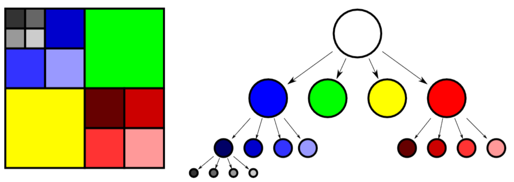
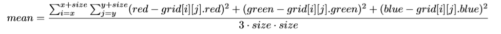
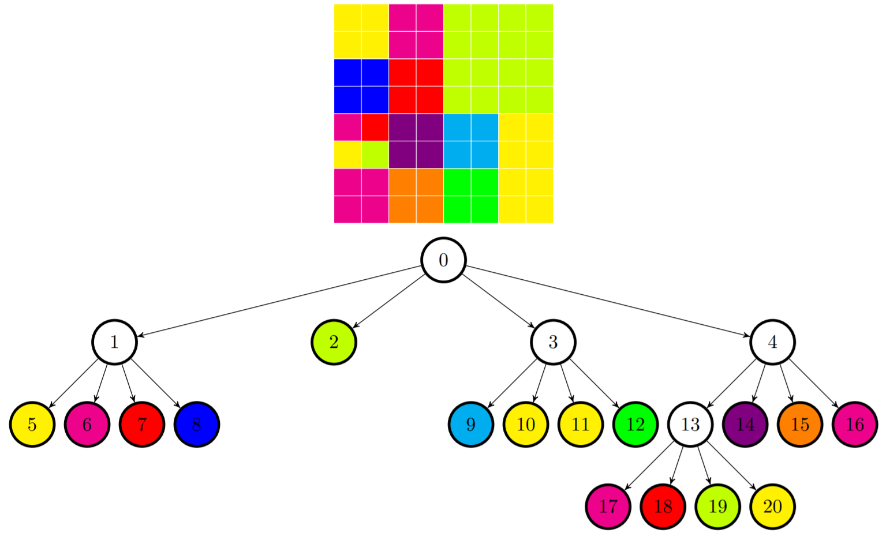
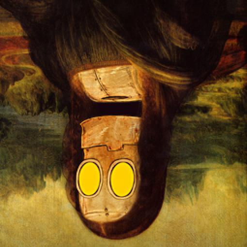

# Quadtree

An application that uses quadtrees for compression, decompression, mirroring and overlaying ppm pictures.

# Idea

For the purpose of this program the images are considered to be squared with a width and height equal to a power of 2.

The root of the tree represents a squre and the 4 children of the root correspond to the 4 squares that make up the entire image.



As long as a child does not contain pixels with a mean color below a certain threshold, it can not represent a leaf node and therefore it has to be split up into another 4 nodes.
We repeat this idea unit all the leaf nodes have pixels with a mean color that corresponds to the selected compression threshold.

The mean color of the pixels is calculated using the following formula

> 

Here is an example of the division of a simple square image:



# Build

```
make
```

# Uses

## Compressing an image into image format

Takes an image and creates a new version of that image that will be compressed.

Command:

```
./quadtree -m <n|v|h> <compression_level> <input_image> <output_image_name>
```

- n - no flip
- h - horizontal flip
- v - vertical flip

Example:

```
./quadtree -m n 370 MOnalisa.ppm image_out.ppm
```

<p float="left">
  
  
</p>

---

## Compressing an image into binary format

Compressed given image intro a binary format that can later be decompressed by the program.

Command:

```
./quadtree -c <compression_level> <input_image> <output_image_name>
```

Example:

```
./quadtree -c 370 MOnalisa.ppm binary.out
```

---

## Decompressing an image

Decompresses the binary output of the compress command into an image.

Command:

```
./quadtree -d <binary_input> <output_image_name>
```

Example:

```
./quadtree -d binary.out new_MOnalisa.ppm
```

---

## Flip Image

Flips an image horizontally or vertically.

### Horizontal Flip

Command:

```
./quadtree -m h <compression_level> <input_image> <output_image_name>
```

Example:

```
./quadtree -m h 100 MOnalisa.ppm h_MOnalisa.ppm
```

<p float="left">
  
  
</p>

### Vertical Flip

Command:

```
./quadtree -m v <compression_level> <input_image> <output_image_name>
```

Example:

```
./quadtree -m v 0 MOnalisa.ppm h_MOnalisa.ppm
```

<p float="left">
  
  
</p>

---

## Overlay two images

Overlay the second image over the first one.

Command:

```
./quadtree -o <compression_level> <input_image1> <input_image2> <output_image_name>
```

Example:

```
./quadtree -o 0 MOnalisa.ppm squares.ppm overlay.ppm
```

<p float="left">
  
  
  
</p>
